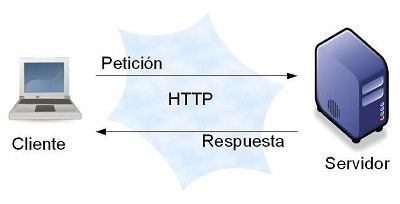

Tecnologias Emergentes II  
By: Rodolfo Isaias Vallejos Quispe

# SISTEMAS EMPRESARIALES

### 1. Explique que son los sistemas empresariales

Un ***Sistema Empresarial*** es un sistema central de la organización, que garantiza que la información se pueda transmitir a través de todas las funciones empresariales, y todos los niveles de gestión, para soportar la oeración y administración de una empresa.

### 2. Describa cuales son las características más importantes de una aplicación empresarial

* Acceso a ***base de datos***, usualmente a bases de datos relacionales.
* Operaciones ***transaccionales***, cumple con las propiedades ACID.
* ***Escalables***, permiten escalabilidad vertical y horizontal.
* ***Disponibles***, idealmente prestan servicios de forma continua.
* ***Seguas***, no todos los usuarios acceden con la misma funcionalidad
* Permiten ***integracion*** con otras tecnologias.
* Arquitectura ***multicapa***.

### 3. Investigue y proponga cinco instituciones que requerirían aplicaciones de misión crítica.

* **Institución Financiera.** Que presta servicios a sus clientes relacionados con su dinero quienes solicitan garantia, seguridad y disponibilidad absoluta.
* **Servicio General de Identificación Personal (SEGIP)** Que garantice la integridad de la los datos de identificacion unica, la unicidad de las personas.
* **Institucion Educativa.** Manejo de información.
* **Aerolineas.** Manejo de información las 24 horas.
* **Telefonia Movil.** Garantiza servicios en cualquier momento y lugar.

### 4. Explique cuáles son las diferencias entre la escalabilidad horizontal y escalabilidad vertical

La ***escalabilidad vertical***, se refiere a actualizaciones o modernización de componentes existes; en cambio la ***escalabilidad horizantal*** se refiere a aumentar el numero de componentes.

### 5. Que es un servidor web y que es un servidor de aplicaciones

* **Servidor web**. Un servidor web o servidor **HTTP** es un programa informático que procesa una aplicación del lado del servidor, realizando conexiones bidireccionales y/o unidireccionales y síncronas o asíncronas con el cliente y generando o cediendo una respuesta en cualquier lenguaje o Aplicación del lado del cliente. El código recibido por el cliente suele ser compilado y ejecutado por un navegador web. Para la transmisión de todos estos datos suele utilizarse algún protocolo. Generalmente se usa el protocolo **HTTP** para estas comunicaciones, perteneciente a la capa de aplicación del modelo **OSI**. El término también se emplea para referirse al ordenador que ejecuta el programa.

* **Servidor de Aplicaciones**. En informática, se denomina servidor de aplicaciones a un servidor en una red de computadores que ejecuta ciertas aplicaciones. Como consecuencia del éxito del lenguaje de programación Java, el término servidor de aplicaciones usualmente hace referencia a un servidor de aplicaciones **Java EE**. Entre los servidores de aplicación **Java EE** privativos más conocidos se encuentran **WebLogic de Oracle (antes BEA Systems)** y **WebSphere de IBM**. **EAServer de Sybase Inc.** es también conocido por ofrecer soporte a otros lenguajes diferentes a Java, como **PowerBuilder**.

### 6. Con un gráfico explique cómo funciona el protocolo HTTP

El protocolo HTTP funciona a través de solicitudes y respuestas entre un cliente y un servidor. A una secuencia de estas solicitudes se le conoce como sesión de HTTP.

### 7. Explique los elementos importantes de REQUEST en HTTP

* Método HTTP para la petición (HTTP Method): usualmente: GET, POST.
* URL a la cual enviar la petición.
* Parámetros del FORM

### 8. Explique los elementos importantes de RESPONSE en HTTP

* Código de estado (status code): Indica si la operación fue realizada correctamente o no.
* Tipo de contenido (Content Type): Si el contenido es HTML, una imagen, un archivo PDF, etc.
* Contenido: el HTML, la imagen, etc.

### 9. Describa con un gráfico la arquitectura Java EE

1. Client tier (Capa Cliente): Componentes que corren en la máquina del cliente.
2. Web tier (Capa Web): Componentes que corren en un contenedor web.
3. Business tier (Capa Negocio): Componentes que corren en un contenedor de negocio.
4. EIS tier (Capa Datos): Acceso a bases de datos y software heredado.

### 10. Explique cuáles son los componentes, contenedores y servicios de Java EE

**Componentes.** El entorno de ejecución de Java EE define cuatro tipos de componentes que una implementación debe soportar:

* ***Applets*** son GUI (interfaz gráfica de usuario) las aplicaciones que se ejecutan en un navegador web. Ellos usan el API Swing para proporcionar interfaces de usuario de gran alcance.

* ***Applications*** son programas que se ejecutan en un cliente. Por lo general son interfaces gráficas de usuario o batchprocessing programas
que tienen acceso a todas las instalaciones de la capa media de Java EE.

* ***Web applications*** (hecha de servlets, filtros de servlets, los detectores de eventos web, páginas JSP y JSF) se ejecutan en un contenedor web y responder a las solicitudes HTTP de los clientes web. Servlets también soportan SOAP y puntos finales de servicios web RESTful. Las aplicaciones Web pueden contener también EJB Lite.

* ***Enterprise applications*** (hecha de Enterprise Java Beans, Java Message Service, Java Transaction API, llamadas asíncronas, servicio de temporizador, RMI / IIOP) se ejecutan en un contenedor EJB. EJB son componentes gestionados por contenedor para el procesamiento de la lógica del negocio transaccional. Se puede acceder localmente y de forma remota a través de RMI (o HTTP para SOAP y servicios web REST).

**Contenedores.** La infraestructura de Java EE se divide en dominios lógicos llamados contenedores. Cada contenedor tiene una función específica, es compatible con un conjunto de APIs, y ofrece servicios a los componentes (seguridad, acceso a bases de datos, manejo de transacción, nombres de directorios, la inyección de recursos). Contenedores ocultar la complejidad técnica y mejorar la portabilidad. Dependiendo del tipo de aplicación que desea construir, usted tendrá que entender las capacidades y limitaciones de cada contenedor con el fin de utilizar uno o más. Por ejemplo, si usted necesita para desarrollar una aplicación web, se desarrollará un nivel de JSF con un nivel de EJB Lite y desplegarlos en un contenedor web. Pero si quieres una aplicación web para invocar una capa de negocio a distancia y el uso de mensajería y llamadas asíncronas, necesitará tanto la web como contenedores EJB. Java EE tiene cuatro recipientes diferentes:

* ***Applet containers*** son proporcionados por la mayoría de los navegadores web para ejecutar los componentes del applet. Al desarrollar applets, puede concentrarse en el aspecto visual de la aplicación, mientras que el recipiente le da un entorno seguro. El contenedor applet utiliza un modelo de seguridad caja de arena donde el código ejecutado en la “caja de arena” no se le permite “jugar fuera de la caja de arena”. Esto significa que el contenedor impide cualquier código descargado en el equipo local accedan a recursos del sistema local, como procesos o archivos.

* ***Application client container*** (ACC) incluye un conjunto de clases Java, bibliotecas y otros archivos necesarios para llevar la inyección, la gestión de la seguridad y el servicio de nombres de aplicaciones Java SE (columpios, el procesamiento por lotes, o simplemente una clase con una principal() método). El ACC se comunica con el contenedor EJB utilizando RMI-IIOP y el contenedor web con HTTP (por ejemplo, para los servicios web).

* ***Web container*** proporciona los servicios subyacentes para la gestión y ejecución de los componentes web (servlets, EJB Lite, JSP, filtros, oyentes, páginas JSF y servicios Web). Es responsable de instanciar, inicialización, e invocando los servlets y el apoyo a los protocolos HTTP y HTTPS. Es el recipiente utilizado para alimentar las páginas web a los navegadores de los clientes.

* ***EJB container*** es responsable de la gestión de la ejecución de los granos de la empresa (beans de sesión y por mensajes) que contiene la capa de lógica de negocio de la aplicación Java EE. Se crea nuevas instancias de EJB, gestiona su ciclo de vida, y ofrece servicios tales como transacciones, la seguridad, concurrencia, distribución, servicio de nombres, o la posibilidad de invocar de forma asíncrona.

**Servicios.** Los contenedores proporcionan servicios subyacentes a sus componentes desplegados. Como desarrollador, contenedores le permiten concentrarse en la implementación de la lógica de negocio en lugar de resolver los problemas técnicos que se plantean en las aplicaciones empresariales. Por ejemplo, la Web y EJB contenedores proporcionan conectores acceder a la EIS, pero no el contenedor applet o los ACC. Java EE ofrece los siguientes
servicios:

* ***Java Transaction API:*** Este servicio ofrece una API de demarcación de transacciones utilizado por el contenedor y la aplicación. También proporciona una interfaz entre el administrador de transacciones y un gestor de recursos a nivel de interfaz de proveedor de servicios (SPI).

* ***Java Persistence API:*** API estándar para el mapeo objeto-relacional (ORM). Con su persistencia Java Query Language (JPQL), se puede consultar objetos almacenados en la base de datos subyacente.

* ***Validation:*** Bean Validation ofrece instalaciones de primera clase y de declaración de restricción a nivel de método y de validación.

* ***Java Message Service:*** Esto permite que los componentes se comunican de forma asíncrona a través de mensajes. Es compatible con la mensajería fiable de punto a punto (P2P), así como el modelo de publicación-suscripción (pub-sub).

* ***Java Naming and Directory Interface:*** Esta API, incluido en Java SE, se utiliza para acceder a la denominación y sistemas de directorio. La aplicación utiliza para asociar (bind) a los nombres de objetos y luego encontrar estos objetos (de búsqueda) en un directorio. Puede buscar fuentes de datos, fábricas JMS, EJB, y otros recursos. Omnipresente en su código hasta J2EE 1.4, JNDI se usa de una manera más transparente a través de la inyección.

* ***JavaMail:*** Muchas aplicaciones requieren la capacidad de enviar mensajes de correo electrónico, que puede implementarse a través del uso de la
API de JavaMail.

* ***JavaBeans Activation Framework:*** La API de JAF, incluido en Java SE, proporciona un marco para el manejo de datos en
diferentes tipos MIME. Es utilizado por JavaMail.

* ***XML processing:*** La mayoría de los componentes de Java EE pueden desplegarse con descriptores de despliegue XML opcionales, y las aplicaciones a menudo tienen que manipular documentos XML. El API Java para Procesamiento de XML (JAXP) proporciona soporte para procesadores de documentos con APIs SAX y DOM, así como para XSLT. La API para XML Transmisión (StAX) proporciona una API de extracción de análisis para XML.

* ***JSON processing:*** Nuevo en Java EE 7 de la API Java para procesamiento JSON (JSON-P) permite a las aplicaciones para analizar, generar, transformar y JSON consulta.

* ***Java EE Connector Architecture:*** Conectores le permiten acceder a EIS de un componente de Java EE. Estas podrían ser las bases de datos, ordenadores centrales, o planificación de recursos empresariales (ERP) programas.

* ***Security services:*** Java Servicio de autenticación y autorización (JAAS) permite a los servicios para autenticar y hacer cumplir los controles de acceso a los usuarios. El contrato de proveedor Java de servicios de autorización de los contenedores (JACC) define un contrato entre un servidor de aplicaciones Java EE y un proveedor de servicios de autorización, permitiendo a los proveedores de servicios de autorización personalizado a ser conectado a cualquier producto Java EE. Servicio de autenticación de Java interfaz de proveedor de los contenedores (JASPIC) define una interfaz estándar por el cual los módulos de autenticación pueden estar integrados con los envases de manera que estos módulos pueden establecer las identidades de autenticación usado por contenedores.

* ***Web services:*** Java EE proporciona soporte para SOAP y servicios web RESTful. La API de Java para servicios web XML (JAX-WS), en sustitución de la JAX-RPC (JAX-RPC), proporciona soporte para servicios web utilizando el protocolo SOAP / HTTP. El JAX-RS (JAX-RS) proporciona soporte para servicios web utilizando el estilo REST.

* ***Dependency Injection:*** Desde Java EE 5, algunos recursos (fuentes de datos, fábricas, unidades de JMS, EJB persistencia...) Se pueden inyectar en componentes administrados. Java EE 7 va más allá mediante el uso de CDI, así como la especificaciones DI (inyección de dependencia para Java).

* ***Management:*** Java EE define las API para la gestión de contenedores y servidores utilizando un grano especial de gestión de la empresa. El (JMX) de la API de Java Management Extensions también se utiliza para proporcionar algo de apoyo a la gestión.

* ***Deployment:*** La implementación de la especificación Java EE define un contrato entre las herramientas de implementación y los productos de Java EE para estandarizar la implementación de aplicaciones.

### 11. Investigue los métodos más utilizados de las clases HttpServlet, HttpServletRequest y HttpServletResponse, y para cada uno de los métodos muestre un ejemplo.

**Algunos métodos de HttpServlet**

* doGet

* doPost

**Algunos métodos de HttpServletRequest**

* getHeader
* getParameter
* getRemoteHost

**Algunos métodos de HttpServletResponse**

* setContentType
* addDateHeader

